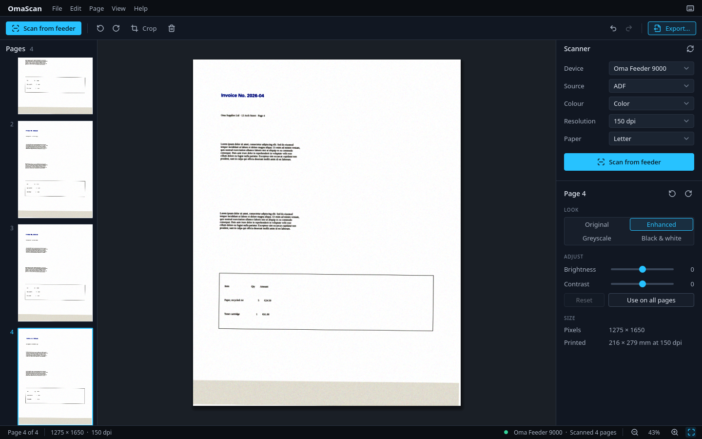
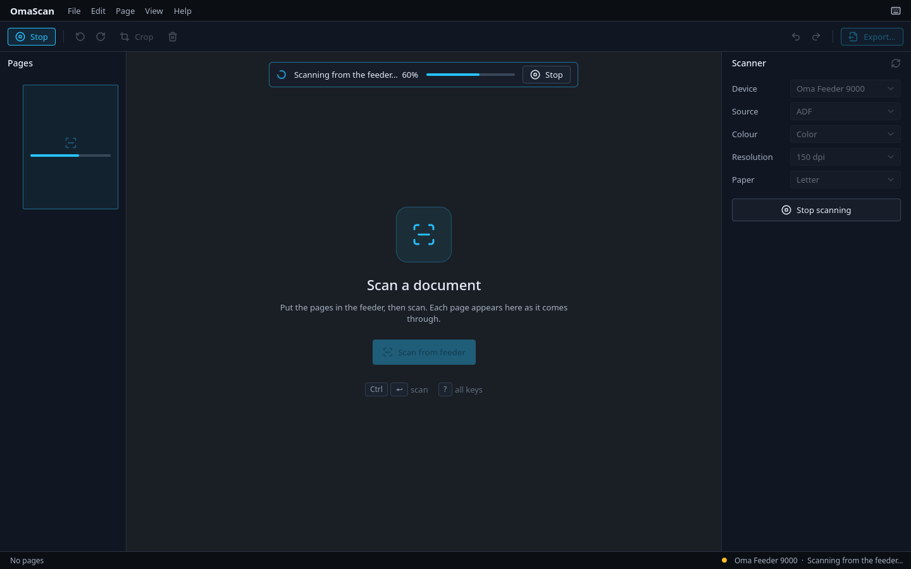
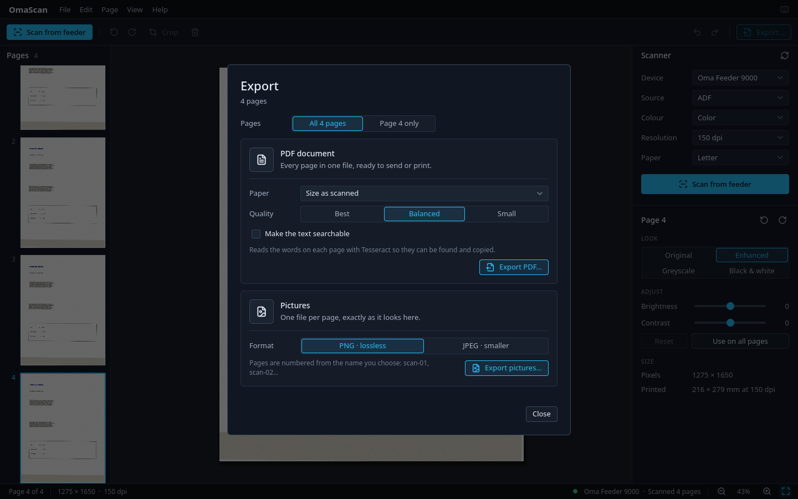

# OmaScan

Scan documents to PDF on Omarchy. OmaScan works with any scanner SANE knows,
follows your Omarchy theme and can be driven entirely from the keyboard. It is
built in the same style as [OmaShow](https://github.com/28allday/omashow).



## Install

OmaScan is made for Omarchy.

1. Open a terminal with **Super + Enter**.
2. Copy and paste these three lines, then press Enter:

   ```sh
   git clone https://github.com/guilhermet/omascan.git ~/omascan
   cd ~/omascan
   ./bin/install
   ```

3. Type your password when asked.
4. When it lists the packages it needs and asks to proceed, press Enter.
5. It then offers two extras. Press Enter to add each:
   - **sane-airscan**, for network scanners. Most printers and scanners made
     since 2015 work through it without a driver.
   - **Tesseract**, for PDFs with searchable text.

OmaScan is built on your computer, which takes a minute or two. When it
finishes, open OmaScan from the app launcher: press **Super + Space** and type
**OmaScan**.

### Updating

```sh
cd ~/omascan
git pull
./bin/install
```

### Removing

```sh
sudo pacman -R omascan
rm -rf ~/omascan
```

## Getting started

Put a page on the scanner and press **Scan** (**Ctrl + Enter**). On a flatbed,
each scan adds one page; scan again for the next. With a document feeder, put
the whole stack in and every page appears as it comes through.



The window has three parts:

- **Pages** on the left: the document so far, in order. Drag a page to move
  it; right-click it to rotate, duplicate, move or delete it.
- **The page** in the middle, on a dark surround so the paper reads clearly.
- **The sidebar** on the right, in two parts:
  - **Scanner** picks the device and how the next page is scanned: source
    (glass or feeder), colour, resolution and paper size. OmaScan remembers
    your choices.
  - **Page** sets how the current page looks.

When the document is done, press **Export** (**Ctrl + E**).

### Getting help

- **Keyboard shortcuts** (**?**, or Help ▸ Keyboard shortcuts) lists every key.
- Hover over any button to see what it does and its key.

## What you can do

### Scanning

- Any scanner SANE supports: USB scanners, and network scanners and printers
  through sane-airscan.
- Flatbed or document feeder, in colour, grey or black and white, at the
  resolutions your scanner offers.
- Scan to a paper size (A4, Letter, Legal, A5) or the whole glass.
- Progress as the page comes in. **Stop** (or **Escape**) cancels.
- When something goes wrong, OmaScan says what to do in plain words, such as
  "The scanner is busy — another app may be using it", with a **Try again**.

### Pages

Every page has a **look**:

| Look | For |
| --- | --- |
| Original | Exactly as scanned |
| Enhanced | White paper and crisp ink, with the paper's colour cast taken out. New pages start here |
| Greyscale | No colour |
| Black & white | Text documents, and the smallest files. Shadows and uneven light don't turn into black blotches |

- Fine-tune any look with **brightness** and **contrast**, and black & white
  with a **threshold**. **Use on all pages** gives the whole document the same look.
- **Rotate** a page a quarter turn, and **crop** it by dragging its edges.
- Reorder, duplicate and delete pages.
- Everything can be undone, and nothing changes the scan itself, so any edit
  can be changed again later.

### Export

- **PDF**: every page in one file, sized as scanned or on A4, Letter or Legal
  paper. **Best** keeps full resolution; **Balanced** and **Small** make
  lighter files for email and web forms. Black & white pages are stored at one
  bit, so a page of text is only a few kilobytes.
- **Searchable PDF**: with Tesseract installed, OmaScan reads the words on each
  page so they can be found and copied. Choose the language when you have more
  than one installed.
- **Pictures**: one PNG or JPEG per page.
- Export the whole document or just the current page.
- Exports run in the background and can be cancelled. When one finishes,
  **Open** it or **Show in folder**.



## Keys

| Key | Action |
| --- | --- |
| `?` / `F1` | Keyboard shortcuts |
| `Ctrl+Enter` | Scan |
| `Escape` | Stop scanning, or leave crop |
| `Ctrl+E` | Export |
| `Ctrl+N` | New document |
| `↑` / `↓` | Previous / next page |
| `Ctrl+↑` / `Ctrl+↓` | Move the page up / down |
| `Ctrl+D` | Duplicate the page |
| `Delete` | Delete the page |
| `[` / `]` | Rotate left / right |
| `C` | Crop; `Enter` applies it |
| `1` `2` `3` `4` | Original / Enhanced / Greyscale / Black & white |
| `Ctrl+Z` / `Ctrl+Shift+Z` | Undo / redo |
| `Ctrl++` or `Ctrl+=` / `Ctrl+-` | Zoom in / out |
| `Ctrl+0` | Fit the page |
| `Ctrl`+wheel | Zoom |

## Your files

- Scans are kept on disk from the moment they arrive, so closing OmaScan or a
  crash doesn't lose them. If you close it before exporting, your pages are
  there the next time it opens, with a **Start new** button if you don't need
  them.
- Once the whole document has been exported, the next start is a clean one.
  **New document** (**Ctrl + N**) starts over at any time.

OmaScan keeps its own data in these folders, and removing the package leaves
them in place:

| Folder | What's in it |
| --- | --- |
| `~/.config/omascan/` | Your scanner and export choices |
| `~/.local/share/omascan/session/` | The pages of the document you're working on |

OmaScan makes no network connections of its own; network scanners are reached
through SANE.

## Scanner not found?

- In a terminal, `scanimage -L` should list your scanner. If it doesn't, SANE
  can't see it, and neither can OmaScan.
- USB scanners need to be switched on and plugged in. A few need their maker's
  driver from the AUR, such as `brscan4` for Brother or `epsonscan2` for
  recent Epsons.
- Network scanners and printers need `sane-airscan`.
- "Not allowed to use the scanner" means your user isn't in the `scanner`
  group: `sudo usermod -aG scanner $USER`, then log out and back in.
- After fixing it, press the refresh button beside **Scanner**.

## Limits

- Pages come from a scanner only; photos of documents can't be added yet.
- Pages aren't straightened or trimmed automatically; crop and rotate them by hand.
- Only the common scanner settings are offered: source, colour, resolution
  and paper size.
- Searchable PDFs need a Tesseract language pack for the document's language,
  such as `tesseract-data-deu` for German.

## Development

```sh
./bin/build     # builds build/omascan
./bin/test      # model and export tests; no window or scanner needed
```

To try OmaScan without a scanner, `bin/fake-scanimage` stands in for SANE's
`scanimage`. It offers a flatbed and a feeder, reports progress, and draws a
page of text:

```sh
OMASCAN_SCANIMAGE=bin/fake-scanimage build/omascan
```

`FAKE_SCAN_PAGES=5` sets how many pages the feeder holds, and
`FAKE_SCAN_FAIL=busy` or `jam` makes the next scan fail.

To photograph the interface without a display (these are the screenshots
above):

```sh
QT_QPA_PLATFORM=offscreen OMASCAN_SCANIMAGE=bin/fake-scanimage \
  build/omascan --ui-shot /tmp/shots
```

How it fits together:

- `src/scanner.cpp` runs SANE's `scanimage`: finding devices, reading their
  options, scanning with progress, feeder batches and cancelling.
- `src/pages.cpp` holds the pages. Each is the untouched scan plus its
  settings (rotation, crop, look), drawn when needed; undo is a copy of the list.
- `src/exporter.cpp` writes PDFs itself (JPEG for colour and grey, one bit for
  black & white), hands searchable PDFs to Tesseract, and writes pictures.
- `src/qml/` is the interface and `src/style/OmaScanStyle/` the controls. Every
  colour and size comes from `src/qml/Theme.qml`; only the accent follows the
  Omarchy theme.
- Icons are [Lucide](https://lucide.dev) (ISC licence). To add one, put its
  name in `tools/icons.txt` and run `tools/gen-icons.py`. After adding a QML
  file, run `tools/gen-qrc.sh`.

## Licence

OmaScan is free software: you can redistribute it and/or modify it under the
terms of the GNU General Public License as published by the Free Software
Foundation, either version 3 of the License, or (at your option) any later
version. See [LICENSE](LICENSE) for the full text.

The icons are from [Lucide](https://lucide.dev), under the ISC licence (see
[src/ui/icons/LICENSE.lucide](src/ui/icons/LICENSE.lucide)).

Copyright (C) 2026 Guilherme Tiscoski.
